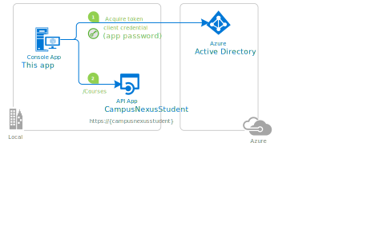
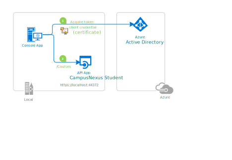

# A .NET Core console application calling a Web API with its own identity

## About this sample

### Overview

This sample application shows how to use the [Microsoft identity platform](http://aka.ms/aadv2) to access the data from a protected CampusNexus Student Web API, in a non-interactive process.  It uses the [OAuth 2 client credentials grant](https://docs.microsoft.com/en-us/azure/active-directory/develop/v2-oauth2-client-creds-grant-flow) to acquire an access token, which is then used to call the Web API. Additionally, it lays down all the steps developers need to take to secure their Web APIs with the [Microsoft identity platform](http://aka.ms/aadv2).

The app is a .NET Core console application that gets the list of "Courses" from `CampusNexusStudent-WebApi` project by using [Token Endpoint](https://aka.ms/aaddev) to acquire an access token for `CampusNexusStudent-WebApi`.

## Scenario

The console application:

- acquires an access token from the Microsoft Identity Platform as an application (no user interaction required)
- and then calls `CampusNexusStudent-WebApi` to get the a list of Courses, displaying the result



For more information on the concepts used in this sample, be sure to read the [Daemon/console application that calls web APIs documentation](https://docs.microsoft.com/en-us/azure/active-directory/develop/scenario-daemon-overview).

> ### Console/Daemon applications can use two forms of secrets to authenticate themselves with Azure AD:
>
> - **application secrets** (also called application password).
> - **certificates**.
>
> This sample covers the first approach (application secret) which is discussed in the next paragraphs.
> A variation of this sample that uses a **certificate** instead, is described at the end of this article in [Variation: console application using client credentials with certificates](#Variation-daemon-application-using-client-credentials-with-certificates)

## How to run this sample

To run this sample, you'll need:

- [Visual Studio 2017/2019](https://aka.ms/vsdownload) or just the [.NET Core SDK](https://www.microsoft.com/net/learn/get-started)
- An Internet connection
- A Windows machine (necessary if you want to run the app on Windows)
- An OS X machine (necessary if you want to run the app on Mac)
- A Linux machine (necessary if you want to run the app on Linux)
- An Azure Active Directory (Azure AD) tenant. For more information on how to get an Azure AD tenant, see [How to get an Azure AD tenant](https://azure.microsoft.com/en-us/documentation/articles/active-directory-howto-tenant/).

### Step 1:  Clone or download this repository

From your shell or command line:

```Shell
git clone https://github.com/campusmanagement/integration-samples.git
```

or download and exact the repository .zip file.

> Given that the name of the sample is pretty long, and so are the name of the referenced NuGet packages, you might want to clone it in a folder close to the root of your hard drive, to avoid file size limitations on Windows.

### Step 2:  Register the sample with your Azure Active Directory tenant

There is one project in this sample. To register it, you can:

#### Choose the Azure AD tenant where you want to create your applications

As a first step you'll need to:

1. Sign in to the [Azure portal](https://portal.azure.com) using either a work or school account or a personal Microsoft account.
1. If your account is present in more than one Azure AD tenant, select `Directory + Subscription` at the top right corner in the menu on top of the page, and switch your portal session to the desired Azure AD tenant.
1. In the left-hand navigation pane, select the **Azure Active Directory** service, and then select **App registrations (Preview)**.

#### Register the service app (CampusNexusStudent-WebApi)

App registration for CampusNexus Student should exist in your tenant already. You will need Application (client) ID for this app registration.

1. Navigate to the Microsoft identity platform for developers [App registrations](https://go.microsoft.com/fwlink/?linkid=2083908) page.
1. Open App Registration for **CampusNexus Student**.
1. On the app **Overview** page, find the **Application (client) ID** value and record it for later. You'll need it to configure the Visual Studio configuration file for this project.

#### Register the sample client app (DotNetODataClientWithClientCredeitnals)

1. Navigate to the Microsoft identity platform for developers [App registrations](https://go.microsoft.com/fwlink/?linkid=2083908) page.
1. Select **New registration**.
   - In the **Name** section, enter a meaningful application name that will be displayed to users of the app, for example `DotNetODataClientWithClientCredeitnals`.
   - In the **Supported account types** section, select **Accounts in this organizational directory only ({tenant name})**.
   - Select **Register** to create the application.
1. On the app **Overview** page, find the **Application (client) ID** value and record it for later. You'll need it to configure the Visual Studio configuration file for this project.
1. From the **Certificates & secrets** page, in the **Client secrets** section, choose **New client secret**:

   - Type a key description (of instance `app secret`),
   - Select a key duration of either **In 1 year**, **In 2 years**, or **Never Expires**.
   - When you press the **Add** button, the key value will be displayed, copy, and save the value in a safe location.
   - You'll need this key later to configure the project in Visual Studio. This key value will not be displayed again, nor retrievable by any other means,
     so record it as soon as it is visible from the Azure portal.
1. In the list of pages for the app, select **API permissions**
   - Click the **Add a permission** button and then,
   - Ensure that the **My APIs** tab is selected
   - Select the API created in the previous step, for example `CampusNexusStudent`
   - In the **Application permissions** section, ensure that the right permissions are checked: **user_impersonation**
   - Select the **Add permissions** button
1. At this stage permissions are assigned correctly but the client app does not allow interaction. 
   Therefore no consent can be presented via a UI and accepted to use the service app. 
   Click the **Grant/revoke admin consent for {tenant}** button, and then select **Yes** when you are asked if you want to grant consent for the
   requested permissions for all account in the tenant.
   You need to be an Azure AD tenant admin to do this.

### Step 3:  Configure the sample to use your Azure AD tenant

In the steps below, "ClientID" is the same as "Application ID" or "AppId".

Open the solution in Visual Studio to configure the projects

#### Configure the client project

1. Open the `DotNetODataClientWithClientCredeitnals\Program.cs` file
1. If you are connecting to a national cloud, change the instance to the correct Azure AD endpoint (tokenEndpointUri). [See this reference for a list of Azure AD endpoints.](https://docs.microsoft.com/graph/deployments#app-registration-and-token-service-root-endpoints)
1. Find the constant `Tenant` and replace the existing value with your Azure AD tenant name.
1. Find the constant `ClientId` and replace the existing value with the application ID (clientId) of the `DotNetODataClientWithClientCredeitnals` application copied from the Azure portal.
1. Find the constant `ClientSecret` and replace the existing value with the key you saved during the creation of the `DotNetODataClientWithClientCredeitnals` app, in the Azure portal.
1. Find the constant `NexusStudentBaseAddress` and set to `https://sisclientweb-{customerid}.campusnexus.cloud/`
1. Find the constant `NexusStudentScope` and replace the existing value with `api://<web api client id>`. The `<web api client id>` is the application id (clientId) of CampusNexusStudent.

### Step 4: Run the sample

Clean the solution, rebuild the solution, and run it.  You might want to go into the solution properties and set both projects as startup projects, with the service project starting first.

Start the application, it will display the users in the tenant.

## Troubleshooting

### Did you forget to provide admin consent? This is needed for daemon/console apps

If you get an error when calling the API `Insufficient privileges to complete the operation.`, this is because the tenant administrator has not granted permissions
to the application. See step 6 of [Register the client app (DotNetODataClientWithClientCredeitnals)](#register-the-client-app-daemon-console) above.

You will typically see, on the output window, something like the following:

```Json
Failed to call the Web Api: Forbidden
Content: {
  "error": {
    "code": "Authorization_RequestDenied",
    "message": "Insufficient privileges to complete the operation.",
    "innerError": {
      "request-id": "<a guid>",
      "date": "<date>"
    }
  }
}
```

## Variation: console application using client credentials with certificates

Console applications can use two forms of secrets to authenticate themselves with Azure AD:

- **application secrets** (also named application password). This is what we've seen so far.
- **certificates**. This is the object of this paragraph.



To [use client credentials protocol flow with certificates](https://docs.microsoft.com/en-us/azure/active-directory/develop/v2-oauth2-client-creds-grant-flow#second-case-access-token-request-with-a-certificate) instead of an application secret, you will need to do little changes to what you have done so far:

- (optionally) generate a certificate and export it, if you don't have one already
- register the certificate with your application in the application registration portal
- enable the sample code to use certificates instead of app secret.