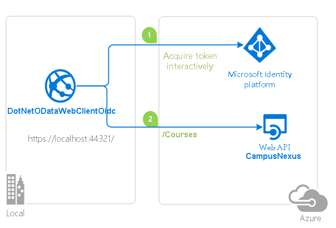

# How to call CampusNexus API built with ASP.NET Core using the Microsoft identity platform (formerly Azure Active Directory for developers)

## About this sample

This sample is essentially a guide for developers who wants to call CampusNexus API using Access Token as user. This sample explains the steps and processes for a client to obtain the necessary permissions and tokens to make successful calls to secured Campus Nexus Api.  

### Scenario

This sample has a web app built using the asp.net core platform which serves as client app for CampusNexus API. The client app signs in users using the [OpenID Connect protocol](https://docs.microsoft.com/en-us/azure/active-directory/develop/v2-protocols-oidc) flow and in this process obtains (and caches) an [access token](https://docs.microsoft.com/en-us/azure/active-directory/develop/access-tokens) for the web api. The client app has a course list that the web app users can work with. The client app calls the CampusNexus Api for all operations for courses.

### Overview

This sample relies upon exising installation of CampusNexus API, which is by default protected by [Azure AD OAuth Bearer](https://docs.microsoft.com/en-us/azure/active-directory/develop/active-directory-v2-protocols) Authentication. The client application uses [MSAL.NET](https://github.com/AzureAD/microsoft-authentication-library-for-dotnet) library to obtain a JWT access token through using the [OAuth 2.0](https://docs.microsoft.com/en-us/azure/active-directory/develop/v2-oauth2-auth-code-flow) protocol flow. 

The client web application essentially takes the following steps to sign-in the user and obtain a bearer token for the Web API:

1. Signs-in the user. When the user signs-in for the first time, a consent screen is presented. This consent screen lets the user consent for the application to access the web API (CoursesService).
1. Acquires an access token for the CampusNexus API.
1. Calls the CampusNexus API using the access token as a bearer token in the authentication header of the Http request. The CampusNexus API validates the caller using the ASP.NET JWT Bearer Authentication middleware.



### The end user experience when using this sample

The client web application (DotNetODataWebClientOidc) enables a user to:

- Sign in to the client app.
- After the sign-in, the user sees the list of courses exposed by CampusNexus API for the signed-in user.
- The user can view detail of courses by clicking on the link on course.

## How to run this sample

### Pre-requisites

- Working URL of CampusNexus
- Install .NET Core for Windows by following the instructions at [dot.net/core](https://dot.net/core), which will include [Visual Studio 2017] or [Visual Studio 2019](https://aka.ms/vsdownload).
- An Internet connection
- An Azure Active Directory (Azure AD) tenant. For more information on how to get an Azure AD tenant, see [How to get an Azure AD tenant](https://azure.microsoft.com/en-us/documentation/articles/active-directory-howto-tenant/)
- A staff account in CampusNexus which is user in your Azure AD tenant.


### Step 1:  Clone or download this repository

From your shell or command line:

```Shell
git clone https://github.com/campusmanagement/integration-samples.git
```

or download and exact the repository .zip file.

> Given that the name of the sample is pretty long, and so are the name of the referenced NuGet packages, you might want to clone it in a folder close to the root of your hard drive, to avoid file size limitations on Windows.

### Step 2:  Register the sample application with your Azure Active Directory tenant

There is one project in this sample, which will need to be registered in your Azure AD tenant. 

#### Choose the Azure AD tenant where you want to create your applications

As a first step you'll need to:

1. Sign in to the [Azure portal](https://portal.azure.com) using either a work or school account or a personal Microsoft account.
1. If your account is present in more than one Azure AD tenant, select your profile at the top right corner in the menu on top of the page, and then **switch directory**.
   Change your portal session to the desired Azure AD tenant.

#### Register the client app (DotNetODataWebClientOidc)

1. Navigate to the Microsoft identity platform for developers [App registrations](https://go.microsoft.com/fwlink/?linkid=2083908) page.
1. Select **New registration**.
1. When the **Register an application page** appears, enter your application's registration information:
   - In the **Name** section, enter a meaningful application name that will be displayed to users of the app, for example `DotNetODataWebClientOidc-aspnetcore-sample`.
   - Leave **Supported account types** on the default setting of **Accounts in this organizational directory only**.
     > Note that there are more than one redirect URIs. You'll need to add them from the **Authentication** tab later after the app has been created successfully.
1. Select **Register** to create the application.
1. On the app **Overview** page, find the **Application (client) ID** value and record it for later. You'll need it to configure the Visual Studio configuration file for this project.
1. From the app's Overview page, select the **Authentication** section.
   - In the Redirect URIs section, select **Web** in the combo-box and enter the following redirect URIs.
       - `https://localhost:44321/`
       - `https://localhost:44321/signin-oidc`
   - In the **Advanced settings** section set **Logout URL** to `https://localhost:44321/signout-oidc`
   - In the **Advanced settings** | **Implicit grant** section, check **ID tokens** as this sample requires
     the [ID Token](https://docs.microsoft.com/azure/active-directory/develop/id-tokens) to be enabled to
     sign-in the user, and call an API.
1. Select **Save**.
1. From the **Certificates & secrets** page, in the **Client secrets** section, choose **New client secret**:

   - Type a key description (of instance `app secret`),
   - Select a key duration of either **In 1 year**, **In 2 years**, or **Never Expires**.
   - When you press the **Add** button, the key value will be displayed, copy, and save the value in a safe location.
   - You'll need this key later to configure the project in Visual Studio. This key value will not be displayed again, nor retrievable by any other means,
     so record it as soon as it is visible from the Azure portal.
1. Select the **API permissions** section
   - Click the **Add a permission** button and then,
   - Ensure that the **APIs my organization uses** tab is selected
   - In the list of APIs, select the API `CampusNexus Student`.
   - In the **Delegated permissions** section, ensure that the right permissions are checked: **Access CampusNexus Student**. 
   - Select the **Add permissions** button

#### CampusNexus API

App registration for CampusNexus Student should exist in your tenant already. You will need Application (client) ID for this app registration.

1. Navigate to the Microsoft identity platform for developers [App registrations](https://go.microsoft.com/fwlink/?linkid=2083908) page.
1. Open App Registration for **CampusNexus Student**.
1. On the app **Overview** page, find the **Application (client) ID** value and record it for later. You'll need it to configure the Visual Studio configuration file for this project.

### Step 3:  Configure the sample to use your Azure AD tenant

In the steps below, "ClientID" is the same as "Application ID" or "AppId".

Open the solution in Visual Studio to configure the project

#### Configure the client project (DotNetODataWebClientOidc)

1. Open the `Client\appsettings.json` file
1. Find the app key `Domain` and replace the existing value with your Azure AD tenant name.
1. Find the app key `TenantId` and replace the existing value with your Azure AD tenant ID.
1. Find the app key `ClientId` and replace the existing value with the application ID (clientId) of the `DotNetODataWebClientOidc-aspnetcore-sample` application copied from the Azure portal.
1. Find the app key `ClientSecret` and replace the existing value with the key you saved during the creation of the `DotNetODataWebClientOidc-aspnetcore-sample` app, in the Azure portal.
1. Find the app key `CampusNexusScope` and replace the existing value with Scope if you changed the name from `api://<campusnexus student client id>/user_impersonation`.
1. Find the app key `CampusNexusBaseAddress` and replace the existing value with the base address of the project.

### Step 4: Run the sample

Clean the solution, rebuild the solution, and run it. 

Explore the sample by signing in into the DotNetODataWebClientOidc client, viewing course list and course detail. If you stop the application without signing out, the next time you run the application, you won't be prompted to sign in again.

> Did the sample not work for you as expected? Did you encounter issues trying this sample? Then please reach out to us.

## More information

For more information, visit the following links:

- This sample is based upon this github [https://github.com/Azure-Samples/active-directory-aspnetcore-webapp-openidconnect-v2](https://github.com/Azure-Samples/active-directory-aspnetcore-webapp-openidconnect-v2)
- Articles about the Microsoft identity platform are at [http://aka.ms/aaddevv2](http://aka.ms/aaddevv2), with a focus on:
  - [Azure AD OAuth Bearer protocol](https://docs.microsoft.com/en-us/azure/active-directory/develop/active-directory-v2-protocols)
  - [The OAuth 2.0 protocol in Azure AD](https://docs.microsoft.com/en-us/azure/active-directory/develop/v2-oauth2-auth-code-flow)
  - [Access token](https://docs.microsoft.com/en-us/azure/active-directory/develop/access-tokens)
  - [The OpenID Connect protocol](https://docs.microsoft.com/en-us/azure/active-directory/develop/v2-protocols-oidc)

- To lean more about the application registration, visit:
  - [Quickstart: Register an application with the Microsoft identity platform (Preview)](https://docs.microsoft.com/en-us/azure/active-directory/develop/quickstart-register-app)
  - [Quickstart: Configure a client application to access web APIs (Preview)](https://docs.microsoft.com/en-us/azure/active-directory/develop/quickstart-configure-app-access-web-apis)
  - [Quickstart: Configure an application to expose web APIs (Preview)](https://docs.microsoft.com/en-us/azure/active-directory/develop/quickstart-configure-app-expose-web-apis)

- To learn more about the code, visit:
  - [Conceptual documentation for MSAL.NET](https://github.com/AzureAD/microsoft-authentication-library-for-dotnet/wiki#conceptual-documentation) and in particular:
  - [Acquiring tokens with authorization codes on web apps](https://github.com/AzureAD/microsoft-authentication-library-for-dotnet/wiki/Acquiring-tokens-with-authorization-codes-on-web-apps)
  - [Customizing Token cache serialization](https://github.com/AzureAD/microsoft-authentication-library-for-dotnet/wiki/token-cache-serialization)

- To learn more about security in aspnetcore,
  - [Introduction to Identity on ASP.NET Core](https://docs.microsoft.com/en-us/aspnet/core/security/authentication/identity?view=aspnetcore-3.1&tabs=visual-studio)
  - [AuthenticationBuilder](https://docs.microsoft.com/en-us/dotnet/api/microsoft.aspnetcore.authentication.authenticationbuilder)
  - [Azure Active Directory with ASP.NET Core](https://docs.microsoft.com/en-us/aspnet/core/security/authentication/azure-active-directory/)
